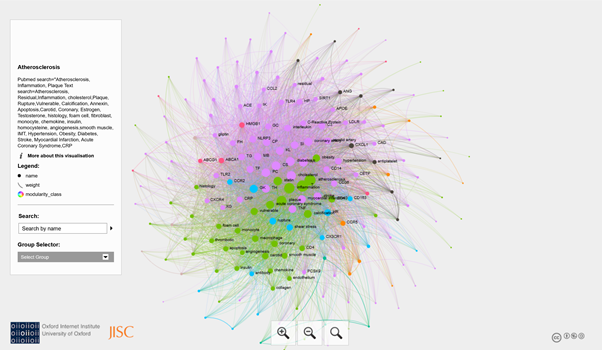

# Mining-Literature-Atherosclerosis
Search PubMed for Gene associations with Atherosclerosis
packages lsa, pubmed.mineR, wordcloud
Atherosclerosis Biological Network. A Pubmed search was performed on 16/1/20 with term "atherosclerosis and inflammation". The file was downloaded as text file. Next, R package pubmed.mineR was used to search genes from HUGO Gene Nomenclature Committee. Latent semantic analysis was performed using a list of terms against the genes. The code is available in athero.Rmd. The data was saved as graphml file and exported to Gephi 0.9.2 for visualisation & community detection. The node names need to be copy from Name column to Label column in Gephi data laboratory. The interactive graph was generated using  Sigma Exporter plugins in Gephi. Before visualisation, a manual editing step for the config.json file is required. 

 
